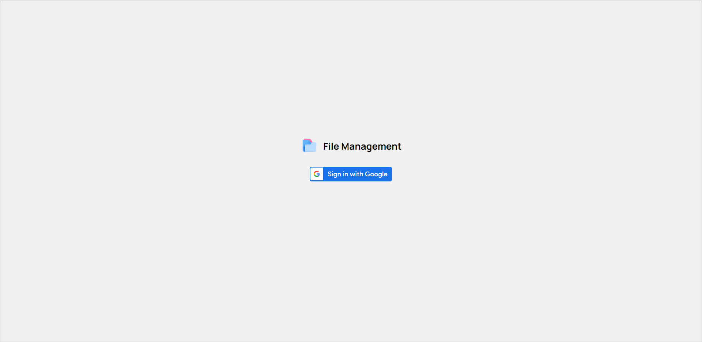
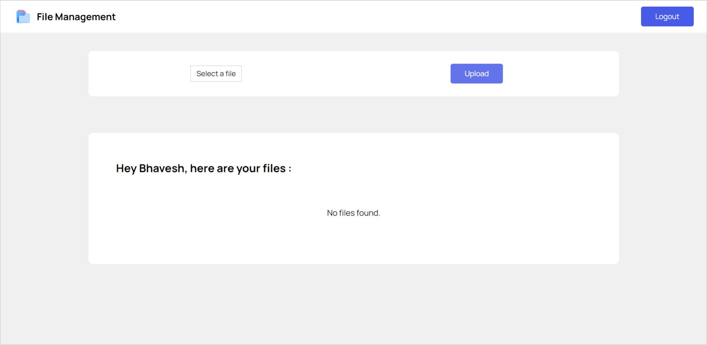
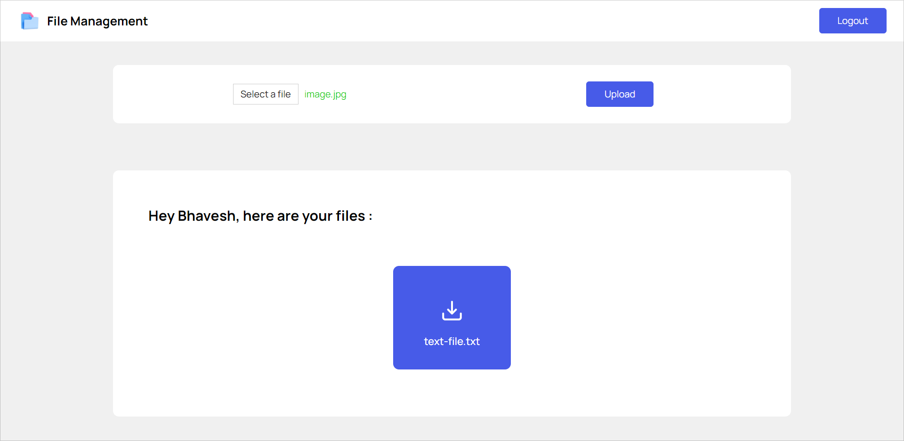
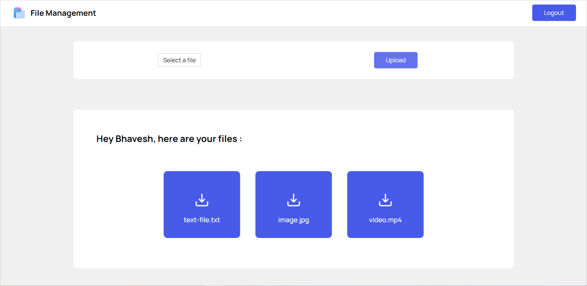
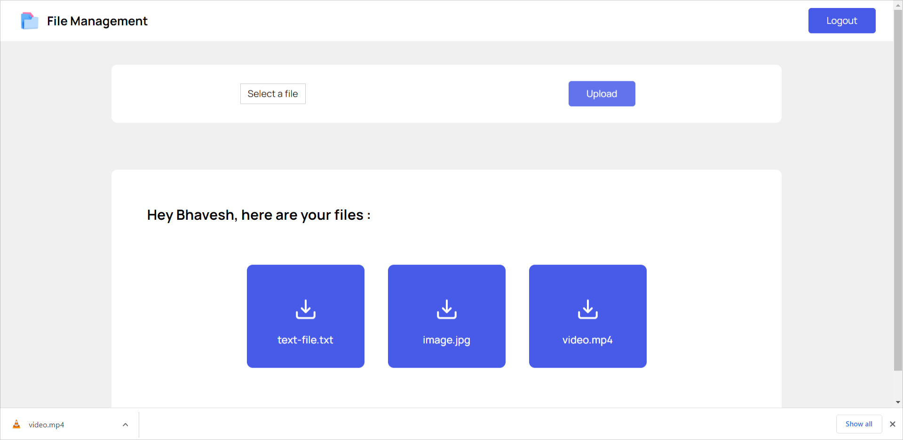

# File Management

Back-end for a modern and lightweight file management application built using the MERN stack.

## Technology stack

- NodeJS
- Express
- MongoDB

## Application Functionalities

- Google Authentication
- Upload file
- View all files
- Download file

## Screenshots

## Note

- You can find the code for this project's front-end [here](https://github.com/bhavesh-gulabani/file-management-client).
